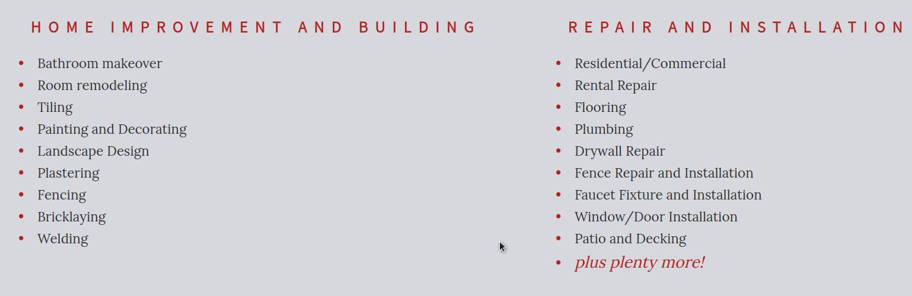

# Right Hands Website for Local Handyman Business

This website was created as a first portfolio project for Code Institute Diploma in Web Development. Right Hands Ltd is a real local handyman business that asked my help in building its online presence back in 2020 by setting and maintaining Facebook page and Google My Business. At the time I was not yet skilled to create a well-rounded responsive website in the timeframe set by the business owner. That is why I offered to construct a website by using website builder platform at www.blacknight.com and assisted with content making process. Today I am excited about being able to create fully functional website and share my work with fellow coders. 

The website can be found [here](https://annahabanna.github.io/right-hands/index.html).

 ------------------
# Table of Contents
 ------------------

* ## UX and UI
    * ### Site Owner Goals
    * ### User Stories
    * ### Wireframes
* ## Design
    * ### Imagery
    * ### Colors
    * ### Fonts
* ## Features
    * ### Header
    * ### Footer
    * ### Hero Section 
    * ### Services
    * ### Portfolio
    * ### Contact
    * ### Future Features
    * ### Responsiveness
* ## Deployment
* ## Testing
    * ### Validator Testing
    * ### Manual Testing
    * ### Bugs
* ## Credits
    * ### Languages
    * ### Frameworks, Libraries and Tools
    * ### Content
    * ### Images
    * ### Acknowledgement

 ----------------
# User UX and UI
 ----------------

* ## Site Owner Goals

    * ### The goals of the site owner are following:

          * #### to inform the user about the type of services the company offers and to briefly introduce itself

          * ####  to provide the user with an option to get in touch and find business contact details including social links

          * #### to showcase the user the previous projects completed by company

          * #### to instill memorable company image and logo

          * #### to implement web design that is simple to navigate for elderly users

* ## User Stories

    * ### First Time Visitor Goals

            * #### The first time user goals are following:
            
            * #### to easily research what services are offered

            * #### to easily navigate around the website

            * #### to look at photos of previously completed projects

            * #### to be able to contact the business owner for a quote

            * #### to find social platform links including Facebook and Instagram
    
    * ### Returning visitor goals

            * #### The returning visitor goals are following:

            * #### to access the website on any chosen device

            * #### to be able to easily navigate to different parts of website 

            * #### to be able to find out the company business hours

    * ### Wireframes

          * #### The wireframes for the website were creted using Figma where each page was drawn separately for both desktop and mobile view. Tablet version of the website was designed to repeat the mobile view.

          * #### The directory containing the wireframe images can be found [here](assets/readme-img/wireframe).

 -------
# Design
 -------

 * ## Colors

    ### The website colors were chosen to match the original website [www.righthands.ie](www.righthands.ie) as the business owner was content with its minimalistic color pallette and black-and-white theme with occassional gray. As my offered web design was small-scale and compact, accents colors were introduced to make the user experience more memorable and likable. The main accent color of Sun (#EB9532) was picked to mimic the yellow element of hero image with additional accents of Burnt Orange (F2784B) and Cranberry (E94F64) that were mainly used in navigation bar and footer design. The picked accents colors are well accessible with great contrast ratio against the background color of Night Rider (#333333) in navigation bar and footer with the Hawkes Blue(#D6D8DE) as font color.
    
    
 
    
 ** Website color pallette ** 

    
    

    ### The background color of the main section is Hawkes Blue (#D6D8DE) which provides soft and subtle effect for the user eye. The only accent color that had a good accessibility rating against the chosed background color was Burnt Orange (F2784B). Additionally, complimentary font-color Fire Brick (#B22222) was used for continuous accessibility.
    
     
 
    
** Color pallette continued **

    
    

    ### The above color pallette was developed after the first choice of color pallette failed Lighthouse contrast test. The subsequent ideas of color pallette always aimed to improve website experience for visually impaired users. [here](www.colorsafe.co) color compatibility tool was mainly used to achieve the best accessibilty possible.

 * ## Fonts

    #### The fonts Lora and Source Sans Pro were chosen from available options from Google Fonts database. The Nautigal handwriting font style was added for company name in the footer for more aesthetic look and as an offset to the strict style of the main fonts.

    #### Source Sans Pro serves as a heading font style and carries over the website minimalistic theme along with tradesman vibe of business.

    #### Lora compliments the heading font and gives paragraphs a more natural reading rhythm.

    #### These fonts were picked with user accessibility and readability in mind, with a backup on Serif for Lora, Sans-Serif for Source Sans Pro and Cursive for The Nautigal for instances when the main fonts may not be available.

-----------
# Features
-----------

 ## Header

  * ### The navigation bar has a fixed position at the top of each page and sits above all other content. It contains company logo that also acts as a home page redirecting button and changes border line color when hovered over.
   
  * ### All links are underlined and highlighted when hovered over so that the user is aware what part of website is being or going to be visited. The underline effect stays on in order to identify currently open page and help the user to establish currently open page. 

  * ### On mobile and tablet view the navigation links collapse into a toggle button for improved user experience. Pressed toggle button reveals stacked navigation links with identical to desktop hover over effect. Navigation links color and background color swap over for more distinguished look assisting the user with navigation as well as the font size increases for the same purpose.

  * ### Navigation bar template was borrowed from [www.codepen.io](https://codepen.io/biblos/pen/babJvO) and later resdesigned according to project needs and design objectives.

  
 
    
 ** Mobile version ** 

  
    

  ## Footer
 

 * ### The footer is designed to sit at the bottom of each page beneath all the content.

 * ### The footer contains a brief about section with highlighted competitive features as well as social platform links, contact details and business hours.

 * ### Desktop view allows three columns of text display horizoontally, whereas mobile and tablet view stack the columns for better usability.

 * ### Responsive footer template was borrowed at [www.webdevtrick.com](https://webdevtrick.com/html-css-footer/) and later redisigned according to project needs

    
 
      
 ** Mobile version ** 

     
    

 ## Hero Section

 * ### The hero image takes up the central width of the viewport with padding on the sides in desktop view and full width in mobile/tablet view. It is styled with zoom in transform effect for high-impact lasting impression with the user.

 * ### The hero image was provided by the business owner.

## Services

 * ### The services page allows the user to look at two  lists of offered services with bulletpoint decoration for better readability.

## Portfolio
 * ### The main aim of the portfolio is to showcase the company past projects displayed in the column of two in desktop view and as a single column in mobile/tablet view. Initial box-shadow decoration and forward transform effect were eliminated to keep the user focus on the completed projects only.

## Contact

 * ### The contact page consists of a list of contact details on the left and a contact form on the right.
 * ### The user has to fill the required name, email and message input fields before clicking submit button below. Post submit page appears with confirmation and thank you message for the user to know that the message was delivered and that a reply will be provided in 24 hours.

## Future Features
 * ### I would like to create a dedicated testimonial page with embedded Google reviews and Facebook widget. 
 * ### I would like to implement a swipeable carousel for portfolio photos.

## Responsiveness
 * ### Felxbox model was used to make the website responsive on all devices.

 ------------
 # Deployment
 ------------

 ## This project was developed using GitPod, pushed to GitHub and deployed to GitHub Pages using the following steps:
  1. ### Log in to GitHub and locate the website creator GitHub Repository ANNAhabANNA/right-hands
  2. ### At the top on the right click Settings, scroll down to GitHub Pages and click to select
  3. ### The website then gets built from the Main branch by default
  4. ### The deployed website link [https://annahabanna.github.io/right-hands/](https://annahabanna.github.io/right-hands/) is then displayed on the top of page.

 -----------
 # Testing
 -----------

 ## Validator Testing
  * ### The website was tested using the tools of World Wide Web Consortium (also known as W3C). The above mentioned tools are the Markup Validation Service and the CSS Validation Service. No error were returned for HTML and CSS code submitted.
  * ### Continuous testing was run using Lighthouse within Google Chrome to verify performance and accessibility standards were met and to ensure best practices were followed.

 
    
 ** Lighthouse Testing Result ** 

    

 
    
 ** HTML Validator Result ** 

    

 
    
 ** CSS Validator Result ** 

    

 ## Manual Testing
  * ### The website was tested manually across a range of devices to ensure all links and styling work correctly and to ensure responsiveness across a range of devices. All features on the page were tested to ensure functionality was not impacted. Testing was carried out on multiple browsers such as Google Chrome, Microsoft Edge, Mozilla Firefox, Safari and Opera. Testing was carried out on an Apple iPhone, Apple iPhone 13, Samsung Galaxy S20 FE, Samsung Galaxy A51, Apple iPad Pro & Windows 10 Desktops. 

    #### Navigation Bar
    1. #### When the company logo is clicked it takes the user to homepage (index.html) from all pages.
    2. #### Each menu link brings the user to the relevant page when clicked.
    3. #### Toggle menu appears for sizes less tha 820px.
    4. #### Round button with stacked menu links appears after toggle menu is clicked.
    5. #### Navigation bar stays fixed on the top of the browser on all devices.
    6. #### Tested on various browsers and mobiles.

    ### Footer
    1. #### Appears when pages are scrolled down.
    2. #### All social media links open in the new tab redirecting to the relevant social media websites.
    3. #### Tested on various browsers and mobiles.

    ### Hamburger Menu
         #### Each link redirects to the relevant page when clicked.
    
    ### Contact Form
    1. #### Request to fill in input fields shows up if form is submitted not fully completed.
    2. #### Request to match the required email format if email field is filled incorrectly.
    3. #### Thank you message appears after all fields are filled correctly.
 
 ## Bugs
* ### During coding navigation bar and footer started to hide main content. Tutor Support helped me with debugging. Solution required to set body element to display: flex with min-height at 100vh, flex-direction: column and margin: 0. Then wrap main content into main tag and flex-grow property to one. Lastly footer position: fixed had to be removed.
* ### During coding services container did not scroll and was half hidden by footer. This was fixed by adding overflow: auto to class services-container.
* ### During testing email input did not validate the correct format of input. This was fixed by addiing label tag with attribute for="email".
* ### Right hand side gap in the content area of each page remains bugged and will be solved in the later stages of the course.
  
 
    
 ** Unsolved Bug ** 

  
   

 --------
# Credits
 --------

 ## Languages
 * ## [HTML](https://en.wikipedia.org/wiki/HTML5)
 * ## [CSS](https://en.wikipedia.org/wiki/CSS)

 ## Frameworks, Libraries and Tools
 * ### Am I Responsive - used to verify responsiveness of website on different devices.
 * ### Figma - used to generate wireframe images.
 * ### Chrome Dev Tools - used for overall development and tweaking, including testing responsiveness and performance.
 * ### Font Awesome - used for social media and contact details icons in the footer and on the contact page.
 * ### GitHub - used for version control and hosting.
 * ### Google Fonts - used to import and alter website typography.
 * ### Slack - used for support and advice from the Code Insitute Community.
 * ### TinyPNG - used to compress images while maintaining the quality.
 * ### GitPod - used for automated dev environment
 * ### W3C - Used for HTML & CSS Validation.
 * ### Lighthouse - used for testing performance, accessibility and search engine optimization.
 * ### Color Safe - used for testing color contrast for better accessibility.
 
 ## Images
 * ### Images are provided by the business owner of Right Hands Ltd.

 ## Content
 * ### Content was borrowed from original Right Hands Ltd [website](www.righthands.ie) that I created in 2020 using wesite builder constructor at [Blacknight Internet Solutions Ltd](www.blacknight.com).

 ## Acknoweledgment
 * ### My Mentor Chris Quinn.
 * ### Code Institute team and community.

